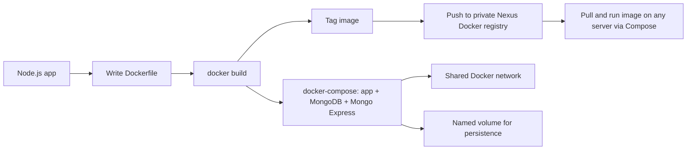

# Docker & Containers

Took an app from "runs on my machine" to a reproducible, networked, multi-container setup: wrote the Dockerfile, orchestrated it with Compose alongside a database, persisted its data, and pushed the built image to a private registry I'd already stood up myself.

**Note on context:** This is hands-on lab work from the TechWorld with Nana DevOps bootcamp (Module 7), building directly on the DigitalOcean and Nexus work in my other two repos. The starting app (`starting-code/app`) is course-provided scaffolding. I'm disclosing that rather than letting it look like more than it is. `final-code/` is where my actual Dockerfile, Compose file, and configuration work live.

## Why This Exists

Containerizing an app is the first real step toward CI/CD. You can't build a Jenkins pipeline or deploy to Kubernetes around something that isn't packaged consistently yet. This project was about getting that packaging step right: a proper Dockerfile, a private place to store the image, and a way to run the whole stack (app, database, admin UI) with one command instead of a page of manual steps.


## Workflow



## What I Did

**1. Ran the database layer as containers first**
Created a dedicated Docker network (`docker network create mongo-network`) so containers could reach each other by name instead of IP, then ran MongoDB and Mongo Express on it with `docker run`, passing root credentials and the `ME_CONFIG_MONGODB_URL` variable Mongo Express needs to find the database, a step that's easy to miss and causes a silent connection failure if skipped.

**2. Wrote a Dockerfile for the app**
Based it on `node:20-alpine` (small, already has Node installed), copied the app in, set the working directory, ran `npm install` inside the build rather than on the host (keeps the image self-contained and reproducible regardless of what's installed locally), and set `CMD ["node", "server.js"]` as the single entry point.

**3. Replaced manual docker run commands with Compose**
Wrote a `docker-compose.yaml` defining all three services, app, MongoDB, Mongo Express, with their ports, environment variables, and a `depends_on` so MongoDB starts before the app tries to reach it. Compose also handles the shared network automatically, so the manual `docker network create` step from earlier became unnecessary once this was in place.

**4. Made data survive container restarts**
By default, anything a container writes disappears when it's removed. Added a named volume (`mongo-data:/data/db`) so MongoDB's data persists across `docker compose down` / `up` cycles, the difference between a demo and something you'd actually trust with real data.

**5. Set up a private registry to push the image to**
Rather than leaving the built image only on my machine, I created a Docker-hosted repository in the Nexus instance from my other lab, opened the matching port on the droplet's firewall, and enabled the Docker Bearer Token realm in Nexus so it could issue auth tokens on `docker login`. Since that Nexus instance runs over HTTP, I also had to explicitly allowlist it as an insecure registry in Docker's daemon config, a deliberate, documented exception, not an oversight.

**6. Tagged, pushed, and verified**
`docker login` then `docker tag my-app:1.0 <registry>:8083/my-app:1.0` then `docker push`. Confirmed the image actually landed by querying the Nexus REST API rather than just trusting the push succeeded.

**7. Pointed the containerized app at the containerized database**
Once the app ran inside Compose instead of directly on the host, its Mongo connection string had to change from `localhost` to the container name (`mongodb://mongodb:27017`), a small but important detail about how container networking differs from running everything on bare metal.

**8. Moved Nexus itself into a container**
As a last step, migrated Nexus, previously installed directly on a VM with a manual Java install, to run as a Docker container on a fresh droplet, using a named volume for its data. Docker was the only prerequisite this time, no Java setup required.


## Skills Demonstrated

Containerization fundamentals (images vs. containers, Docker Engine architecture), writing Dockerfiles with production-conscious choices like small base images and installing dependencies inside the build, container networking through custom bridge networks and service discovery by name, multi-container orchestration with Docker Compose, persistent storage via named volumes, private container registry workflows (tag, push, pull against a self-hosted Nexus Docker registry), firewall and realm configuration to support a registry rather than just an app, and debugging containers with `docker logs`, `docker ps`, and `docker exec`.

## Repo Structure

```
.
├── starting-code/app/   # course-provided starter app, pre-containerization
└── final-code/
    ├── app/             # the working application
    ├── Dockerfile
    ├── docker-compose.yaml
    └── docker_commands.md
```

## Key Commands

```bash
# Build and tag
docker build -t my-app:1.0 .
docker tag my-app:1.0 <registry-ip>:8083/my-app:1.0

# Push to private registry
docker login <registry-ip>:8083
docker push <registry-ip>:8083/my-app:1.0

# Run the full stack
docker compose -f docker-compose.yaml up
docker compose -f docker-compose.yaml down

# Debug
docker logs <container-name> -f
docker exec -it <container-name> bash
```


## Notes & Limitations

Replace placeholders like `<droplet-ip>` and `<registry-ip>` with real values when reproducing this. The registry runs over HTTP in this lab, which is why the insecure-registry configuration shows up. A real deployment would put TLS in front of it. Port 8081 is Nexus's UI; 8083 is the separate port I dedicated to the Docker registry so the two don't collide.

## Related Projects

[`web-app-on-digitalocean`](https://github.com/shahtaj2102/web-app-on-digitalocean) covers the droplet and firewall fundamentals this builds on, and [`Nexus_Repository_Manager`](https://github.com/shahtaj2102/Nexus_Repository_Manager) is the registry this project pushes images into.

---
Shahtaj Singh Gill - [LinkedIn](https://www.linkedin.com/in/shahtaj-aws-sap-toronto/) / [GitHub](https://github.com/shahtaj2102)
